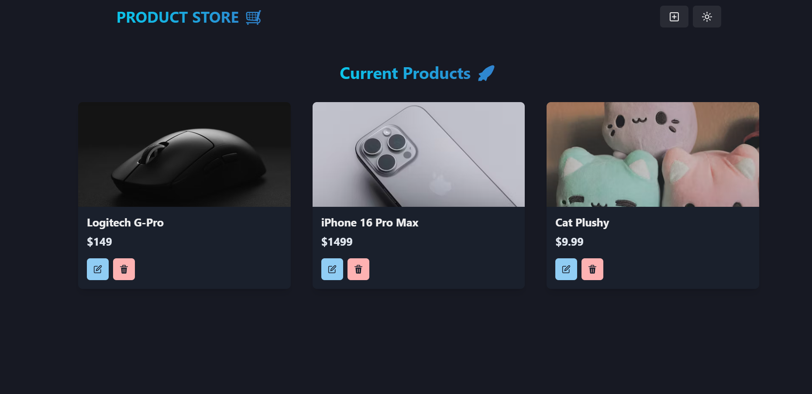

<h1 align="center">Product Store 🚀</h1>

 

About This Course:

-    Tech Stack: React.js, Node.js, Express.js, MongoDB, Chakra UI
-    Build an API
-    Responsive UI With React.js and ChakraUI
-    Error Handling
-    Deployment
-    And Many More Cool Features

### Setup .env file

```shell
MONGO_URI=your_mongo_uri
PORT=5000
```

### Run this app locally

```shell
npm run build
```

### Start the app

```shell
npm run start
```
